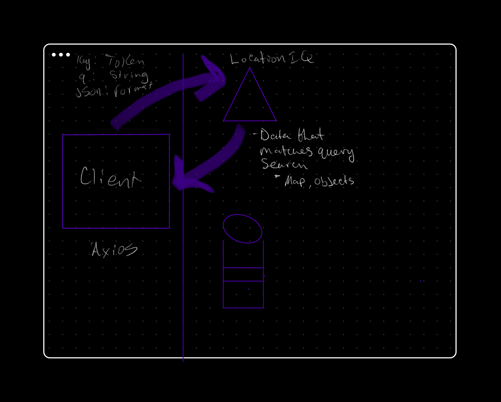

# Project Name

**Author**: Nate Brown
**Version**: 1.0.1 (increment the patch/fix version number if you make more commits past your first submission)

## Overview

<!-- Provide a high level overview of what this application is and why you are building it, beyond the fact that it's an assignment for this class. (i.e. What's your problem domain?) -->

This app allows a user to enter the name of a city anywhere in the world, and return information about the city using a third-party API, LocationIQ.

## Getting Started

<!-- What are the steps that a user must take in order to build this app on their own machine and get it running? -->

User must have npm and React installed on their computer.

## Architecture

<!-- Provide a detailed description of the application design. What technologies (languages, libraries, etc) you're using, and any other relevant design information. -->

App written in React. Incorporates LocationIQ API.

## Change Log
<!-- Use this area to document the iterative changes made to your application as each feature is successfully implemented. Use time stamps. Here's an example:

01-01-2001 4:59pm - Application now has a fully-functional express server, with a GET route for the location resource. -->

2221 06 Mar 2023 - v1.0.1 - React repository and API key setup complete

## Credit and Collaborations
<!-- Give credit (and a link) to other people or resources that helped you build this application. -->

Time Estimates
For each of the lab features, make an estimate of the time it will take you to complete the feature, and record your start and finish times for that feature:

Name of feature: Set up React repository and API keys
Estimate of time needed to complete: 30 min
Start time: 2200
Finish time: 2221
Actual time needed to complete: 21 min

Name of feature: Locations
Estimate of time needed to complete: 30 min
Start time: 2224
Finish time: 2348
Actual time needed to complete: Incomplete

Name of feature: Map
Estimate of time needed to complete: 
Start time: NA
Finish time: 
Actual time needed to complete: NA

Name of feature: Errors
Estimate of time needed to complete: 
Start time: NA
Finish time: 
Actual time needed to complete: NA

